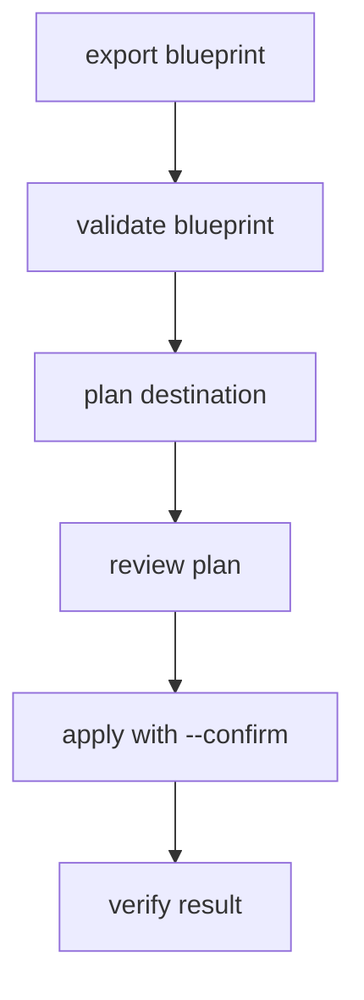

# Architecture

M1 separates source inspection from future destination mutation code.

## Modules

| Module | Purpose |
| --- | --- |
| `config.py` | Loads Telegram API settings from environment variables. |
| `client.py` | Creates the Telethon client. |
| `dialogs.py` | Resolves a provided source or prompts for dialog selection. |
| `inspection.py` | Performs read-only source inspection and builds the blueprint. |
| `blueprint.py` | Owns the versioned blueprint model and unsupported-property reporting. |
| `serialization.py` | Converts Telethon objects into stable JSON-safe values. |
| `validation.py` | Validates blueprint schema and reports blocking issues. |
| `planning.py` | Converts a valid blueprint into a dry-run destination plan. |
| `replication/` | Destination creation and structure replication behind explicit commands. |
| `verification/` | Plan/result verification reports. |

## Read-Only Boundary

M1 only performs entity resolution, full chat/channel reads, and forum topic reads. M2 only reads/writes local JSON artifacts. No mutation request classes are called from `inspection.py`, `validation.py`, or `planning.py`.

Write-capable code stays under `replication/`, with tests that prove source inspection remains free of destination writes. The CLI requires `apply --confirm` before any Telegram mutation can run.

## Workflow

## Unsupported Properties

Telegram does not expose every UI-visible property to every account or entity type. Exporters should add an `unsupported_properties` item whenever a known property is unavailable, permission-limited, intentionally out of scope, or not yet implemented.
